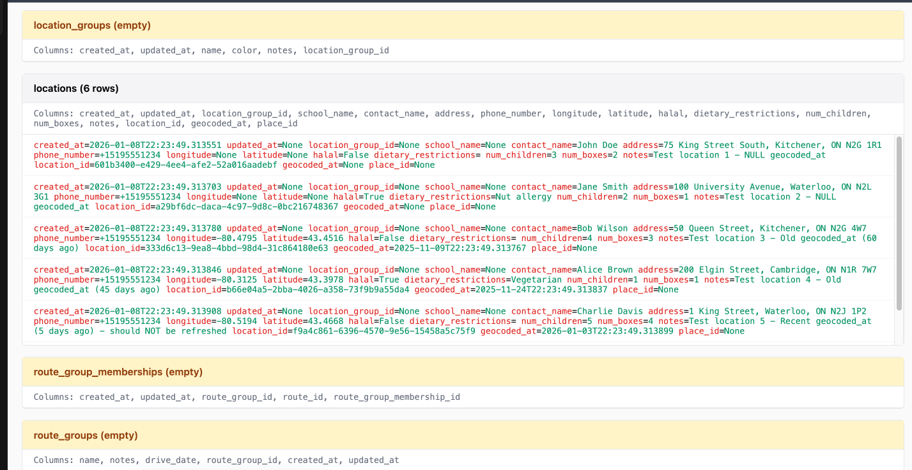
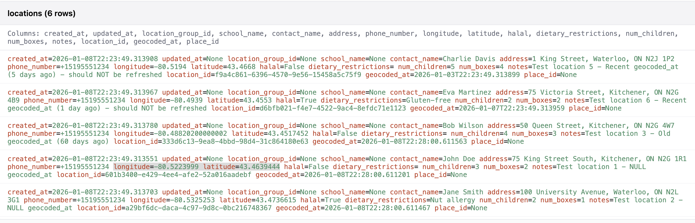

# Food4Kids

## Table of Contents

- [Tech Stack](#tech-stack)
- [Repo Structure](#repo-structure)
- [Development Setup](#development-setup)
- [Application Execution](#application-execution)
- [API Testing with Postman](#api-testing-with-postman)
- [Database Interactions](#database-interactions)
- [Geocoding Update](#geocoding-update)
- [Version Control Guide](#version-control-guide)
  - [Branching](#branching)
  - [Docker Commands](#docker-commands)
- [Formatting and Linting](#formatting-and-linting)
- [Testing](#testing)
- [FAQ & Debugging](#faq--debugging)

## Tech Stack

**Frontend:** React, TypeScript
**Backend:** Python, FastAPI, SQLModel
**Database:** PostgreSQL  
**Authentication:** Firebase Auth  
**Containerization:** Docker & Docker Compose

## Repo Structure

```
food4kids/
├── backend/
│   └── python/
│       ├── app/
│       │   ├── dependencies/       # Dependency injection (auth, etc.)
│       │   ├── migrations/         # Alembic database migrations
│       │   ├── models/             # SQLModel database models
│       │   ├── routers/            # FastAPI route handlers
│       │   ├── schemas/            # Pydantic schemas for API
│       │   ├── services/           # Business logic layer
│       │   │   ├── implementations/ # Concrete service implementations
│       │   │   └── jobs/           # Scheduled Cron Jobs
│       │   │   └── protocols/      # Algorithms and how the server handles data
│       │   ├── templates/          # Email/HTML templates
│       │   └── utilities/          # Shared utility functions
│       ├── tests/                  # Unit and functional tests
│       ├── alembic.ini            # Alembic configuration
│       ├── requirements.txt       # Python dependencies
│       └── server.py              # Application entry point
├── frontend/                      # Frontend (TBD)
├── db-init/                       # Database initialization scripts
├── docker-compose.yml             # Multi-container Docker setup
└── README.md
```

## Development Setup

### Prerequisites

- Install [Docker Desktop](https://docs.docker.com/get-started/get-docker/) and ensure it's running
- Clone this repository:

```bash
git clone git@github.com:uwblueprint/food4kids.git
cd food4kids
```

### Environment Configuration

You will need to create environment files: `.env` and `frontend/.env`. Talk to the PL to obtain these.

### Installation

Build and start all services using Docker Compose:

```bash
docker-compose up --build
```

This will start:

- **Frontend**: React development server on port 3000
- **Backend**: FastAPI server on port 8080
- **Database**: PostgreSQL on port 5432

## Application Execution

```bash
# Start all services
docker-compose up --build

# Start in detached mode (background)
docker-compose up -d --build
```

**Access Points:**

- Frontend: http://localhost:3000
- Backend API: http://localhost:8080
- API Documentation: http://localhost:8080/docs (development only)
- ReDoc Documentation: http://localhost:8080/redoc (development only)

## API Testing with Postman

Postman is a powerful tool for testing API endpoints during development. For detailed setup instructions and best practices, see our [Postman Setup Guide](https://www.notion.so/uwblueprintexecs/Postman-Setup-28410f3fb1dc80f8b1e8c414c4a21802?source=copy_link).

**Quick Start:**

1. Ensure the backend container is running (`docker-compose up`)
2. Import the Postman collection (if available) or manually configure requests
3. Set the base URL to `http://localhost:8080`
4. Configure authentication headers as needed (see the Notion guide for details)

**Alternative:** You can also test endpoints using the interactive Swagger UI at http://localhost:8080/docs

## Database Interactions

### Migration Commands

The project uses Alembic for database migrations. All commands run from the project root:

```bash
# Check current migration status
docker-compose exec backend alembic current

# Generate new migration (auto-detect model changes)
docker-compose exec backend alembic revision --autogenerate -m "description_of_changes"

# Apply pending migrations
docker-compose exec backend alembic upgrade head

# Check if database schema matches models
docker-compose exec backend alembic check

# View migration history
docker-compose exec backend alembic history
```

### Direct Database Access

```bash
# Connect to development database
docker-compose exec db psql -U postgres -d f4k

# Connect to test database
docker-compose exec db psql -U postgres -d f4k_test

# Once inside the DB, try these common PostgreSQL commands:
\dt          # List all tables
\d table_name # Describe table structure
\q           # Quit
SELECT * FROM users; # Run SQL queries
```

### Database Seeding

```bash
# Populate database with randomized test data
docker-compose exec backend python app/seed_database.py
```

## Geocoding Update

The system includes an automated geocoding refresh cron job that updates location coordinates using the Google Maps Geocoding API.

### Features

- **Automatic refresh** of location coordinates that are NULL or older than 30 days
- **Respects `route_archive_after`** setting in admin_info (default: 30 days)
- **Scheduled job** that runs daily at midnight EST
- **Manual trigger** via API endpoint

### Test Data

Seed the database with test locations for geocoding:

```bash
docker-compose exec backend python -w /app app/seed_geocoding_test_data.py
```

### Before Update

Locations with NULL coordinates or stale geocoding data:



### After Update

Locations with refreshed coordinates from Google Geocoding API:



### Manual Trigger

```bash
# Trigger geocoding refresh job manually
docker-compose exec backend python -c "from app.services.jobs.geocoding_refresh import run_geocoding_refresh_job; import asyncio; asyncio.run(run_geocoding_refresh_job())"
```

## Version Control Guide

### Branching

- Branch off `main` for all feature work and bug fixes
- Use descriptive branch names in kebab-case: `username/feature-description`
- Example: `colin/user-authentication-fix`

### Integrating Changes

Use rebase instead of merge to integrate `main` changes:

```bash
# Update feature branch with main changes
git pull origin main --rebase

# If conflicts occur, resolve them and continue
git add .
git rebase --continue

# Force push to remote feature branch
git push --force-with-lease
```

### Docker Commands

```bash
# Build images
docker-compose build

# Start containers (builds if needed)
docker-compose up

# Start with fresh build
docker-compose up --build

# Stop containers
docker-compose down

# Stop containers and remove volumes
docker-compose down --volumes

# View running containers
docker ps

# Clean up unused Docker resources
docker system prune -a --volumes
```

## Formatting and Linting

### Backend (Python)

The project uses **Ruff** for Python linting and formatting, and **mypy** for static type checking:

#### Ruff (Linting & Formatting)

```bash
# Check for linting issues
docker-compose exec backend ruff check .

# Auto-fix linting issues
docker-compose exec backend ruff check --fix .

# Format code
docker-compose exec backend ruff format .

# Check formatting without making changes
docker-compose exec backend ruff format --check .
```

#### mypy (Static Type Checking)

```bash
# Run type checking
docker-compose exec backend mypy .
```

#### Combined Quality Checks

```bash
# Run all quality checks (linting, formatting, type checking)
docker-compose exec backend ruff check . && docker-compose exec backend ruff format --check . && docker-compose exec backend mypy .
```

**Configuration Files:**

- Ruff: `backend/python/pyproject.toml` (under `[tool.ruff]`)
- mypy: `backend/python/mypy.ini`

### Frontend (TypeScript/React)

```bash
# Check linting issues
docker-compose exec frontend npm run lint

# Auto-fix linting issues
docker-compose exec frontend npm run fix

# Combined format and lint (when available)
docker-compose exec frontend npm run format
```

## Testing

### Backend Tests

```bash
# Run all backend tests
docker-compose exec backend python -m pytest

# Run specific test file
docker-compose exec backend python -m pytest tests/unit/test_models.py

# Run with coverage
docker-compose exec backend python -m pytest --cov=app
```

### Frontend Tests

```bash
# Run frontend tests
docker-compose exec frontend npm test

# Run tests in CI mode
docker-compose exec frontend npm test -- --ci --coverage --watchAll=false
```

_Note: CI/CD pipeline for automated testing will be added in future updates._

## FAQ & Debugging

<details>
<summary>How do I test API endpoints?</summary>

- Ensure the backend container is running
- Visit http://localhost:8080/docs for interactive API documentation
- Use the "Authorize" button to add your Firebase auth token
- Test endpoints in Postman or directly in the Swagger UI

</details>

<details>
<summary>Database connection errors</summary>

- Ensure Docker Desktop is running
- Check that the database container is healthy: `docker-compose ps`
- Verify environment variables in `.env` file
- Try rebuilding containers: `docker-compose down --volumes && docker-compose up --build`

</details>

<details>
<summary>"ENOSPC: no space left on device" when building containers</summary>

Clean up Docker resources:

```bash
docker system prune -a --volumes
docker-compose up --build
```

</details>

<details>
<summary>Migration errors</summary>

- Check current migration status: `docker-compose exec backend alembic current`
- Ensure database is running and accessible
- Verify model changes are properly defined in `app/models/`
- For migration conflicts, you may need to manually resolve in the database

</details>

<details>
<summary>Firebase authentication issues</summary>

- Verify Firebase configuration in environment files
- Check that Firebase project settings match your configuration
- Ensure Firebase Admin SDK credentials are properly formatted

</details>

## Contributing

1. Fork the repository
2. Create a feature branch from `main`
3. Make your changes following the coding standards
4. Run tests and linting
5. Submit a pull request with a clear description

## License

[Add license information here]
